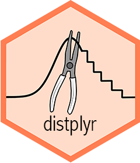

<!-- README.md is generated from README.Rmd. Please edit that file -->

```{r, include = FALSE}
knitr::opts_chunk$set(
  collapse = TRUE,
  comment = "#>",
  fig.path = "man/figures/README-",
  out.width = "100%",
  fig.width = 8, 
  fig.height = 5, 
  fig.align = "center"
)
```

# distplyr 

<!-- badges: start -->
[](https://cran.r-project.org/web/licenses/MIT)
[](https://github.com/probaverse/distplyr/actions/workflows/R-CMD-check.yaml)
[](https://lifecycle.r-lib.org/articles/stages.html#stable)
[](https://app.codecov.io/gh/probaverse/distplyr)
<!-- badges: end -->

`distplyr` breathes life into probability distributions by providing a grammar for their modification and reshaping. It works seamlessly with distribution objects from the [distionary](https://distionary.probaverse.com) package, and builds on the [`probaverse` ecosystem](https://probaverse.com) for making representative statistical models.

With `distplyr`, you can manipulate probability distributions using an intuitive grammar of verbs. Apply transformations, combine distributions, and build complex probabilistic models from simple building blocks -- all while maintaining mathematical correctness and internal consistency.

The name "distplyr" is inspired by [dplyr](https://dplyr.tidyverse.org/): while dplyr provides a grammar for manipulating data, `distplyr` provides a grammar for manipulating _distributions_.

## Statement of Need

Real-world phenomena rarely follow simple textbook distributions. They arise from transformations, combinations, and compositions of simpler processes. The annual maximum flow in a river may be the larger of a snowmelt-related flow and a rainfall-related flow; a distribution of residuals can be moved over a regression equation to obtain a predictive distribution; marginal distributions can be estimated by averaging component distributions; a rainfall total might be a mixture of 70% dry days (zeros) and `30% Gamma-distributed amounts.

While R has excellent support for standard distributions, it lacks a systematic way to _transform and combine_ them. When you need to work with the distribution of a transformed or combined random variable, you're often left deriving formulas by hand or resorting to simulation. `distplyr` fills this gap by providing a consistent grammar of verbs for distribution manipulation, built on top of the flexible `distionary` infrastructure. Define your distributions, apply transformations, and let the package handle the mathematical details.

## Target Audience

`distplyr` is designed for:

- **Data scientists and statisticians** who need to build custom probability models that go beyond standard parametric families.
- **Researchers** in fields like environmental science, finance, engineering, and insurance where complex distributions arise from combining and transforming simpler processes.
- **Modelers** who want to express their domain knowledge through distribution manipulations rather than being constrained by pre-packaged options.
- **Students and educators** learning about probability distributions, their transformations, and how random variables combine.
- **Anyone** who wants an intuitive, programmatic way to work with distributions rather than deriving formulas by hand or running simulations.

If you work with probability distributions and find yourself wishing you could "just shift this," "mix these together," or "see what happens when I transform this," then `distplyr` is for you.

## Installation

To install `distplyr`, run the following code in R:

``` r
install.packages("distplyr")
```

## Development Status

`distplyr` is under active development and, while functional, is still young and will experience growing pains. For example, it currently struggles with manipulating some distributions that aren't continuous, and warnings or errors are provided in these cases. These limitations will be addressed as development continues. We appreciate your patience and welcome contributions! Please see the [contributing guide](.github/CONTRIBUTING.md) to get started.

## Quick Start

```{r setup, warning = FALSE, message = FALSE}
library(distionary)
library(distplyr)
```

Transform distributions using functions or operators:

```{r basic-transform}
# Create a standard Normal distribution
a <- dst_norm(0, 1)

# Transform using functions
shift(a, 10)
multiply(a, 2)

# Or use operators
10 + 2 * a
```

These all simplify to other Normal distributions, but that's not always the case.

```{r}
b <- dst_beta(3, 2)
d <- b * 2
d
```

Visualize this multiplication:

```{r}
plot(b, to = 2)
plot(d, add = TRUE,  col = "red")
legend(
  "topright",
  legend = c("Original", "Multiplied by 2"),
  col = c("black", "red"),
  lty = 1
)
```

Apply mathematical transformations.

```{r}
log(dst_gamma(4, 2))
```

Or combine distributions; in this case, by the maximum.

```{r extrema}
# Maximum of three sites
site1 <- dst_norm(20, 2)
site2 <- dst_norm(22, 3)
site3 <- 2 * dst_t(3) + 19

regional_max <- maximize(site1, site2, site3)

# Plot these distributions
plot(site1, lty = 2, col = "red", from = 10, to = 30)
plot(site2, add = TRUE, lty = 2, col = "blue")
plot(site3, add = TRUE, lty = 2, col = "green")
plot(regional_max, add = TRUE)
legend(
  "topright",
  legend = c("Maximum", "Site 1", "Site 2", "Site 3"),
  col = c("black", "red", "blue", "green"),
  lty = 1
)
```

## Learn More

See **`vignette("manipulating")`** for a comprehensive guide to all verbs, including operators (`+`, `-`, `*`, `/`), math functions (`exp()`, `log()`, `sqrt()`), and understanding when operations simplify to known distributions.

## Correctness and Reliability

`distplyr` employs rigorous testing to ensure mathematical and computational correctness:

**Internal Consistency**: All distribution properties remain mathematically consistent with each other. For example, the density integrates to the CDF, the mean calculated from the density matches the specified mean, and quantile and CDF functions are proper inverses.

**Simplification Correctness**: When operations simplify to known distributions (e.g., exp of Normal becomes Log Normal), the package verifies that simplified and non-simplified versions produce equivalent distributions by comparing their CDFs over a fine grid of points. See `vignette("manipulating")` for details on simplifications.

## `distplyr` in the Context of Other Packages

The R ecosystem offers several packages for working with probability distributions:

- **`stats` Package**: Provides functions for standard distributions (`rnorm`, `pnorm`, etc.) but lacks tools for transformation and composition.

- **`distr` Package**: Offers an S4 object-oriented framework for distributions with transformation capabilities, but has a steeper learning curve and complex interface.

- **`distributions3` Package**: Provides an S3-based interface focused on simplicity, suitable for working with standard distributions but limited in transformation capabilities.

- **`distributional` Package**: Extends `distributions3` with vectorization support and some transformations, but less flexible for custom operations.

In this landscape, `distplyr` addresses the need for a systematic approach to distribution manipulation through a grammar-based framework. Built on the flexible `distionary` infrastructure, operations maintain mathematical correctness through automatic simplifications and can be chained naturally to build arbitrarily complex distributions from simple building blocks. The extensible framework supports adding new transformation verbs and distribution families as needed, making it a key component to the `probaverse` ecosystem.

## Acknowledgements

The creation of `distplyr` would not have been possible without the support of BGC Engineering Inc., the Politecnico di Milano, the European Space Agency, The University of British Columbia, and the Natural Science and Engineering Research Council of Canada (NSERC). The authors would also like to thank the reviewers from ROpenSci during the review process of the `distionary` package, as their insightful feedback also helped in the development of `distplyr`.

## Citation

To cite package `distplyr` in publications use:

  Coia V (2025). _distplyr: Manipulation of Probability
  Distributions_. R package version 0.2.0,
  https://github.com/probaverse/distplyr,
  <https://distplyr.probaverse.com/>.

## Code of Conduct

Please note that the distplyr project is released with a [Contributor Code of Conduct](https://distplyr.probaverse.com/CODE_OF_CONDUCT.html). By contributing to this project, you agree to abide by its terms.
