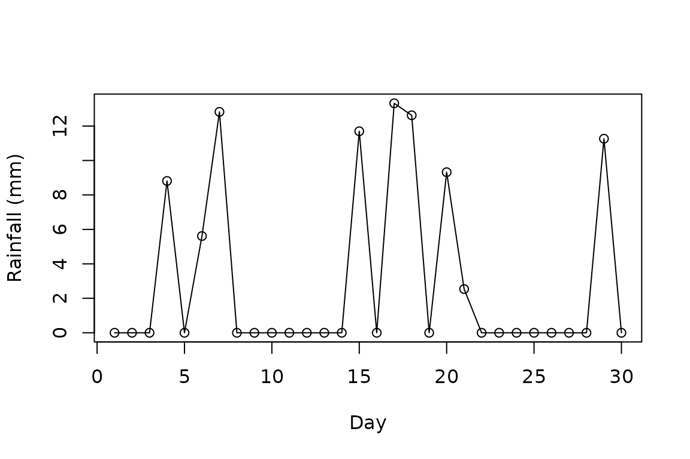

# Manipulating Distributions

Load the packages to get started:

``` r
library(distplyr)
library(distionary)
```

## Introduction

`distplyr` provides a grammar of verbs for manipulating probability
distributions. Operations take distribution(s) as input, return a
distribution as output, maintain mathematical correctness, and can be
chained together.

### Development Status

**Note**: `distplyr` is under active development and, while functional,
is still young and will experience growing pains. For example, it
currently struggles with manipulating some distributions that aren’t
continuous. These limitations will be addressed as development
continues. We appreciate your patience and welcome contributions! Please
see the [contributing
guide](https://github.com/probaverse/distplyr/blob/main/.github/CONTRIBUTING.md)
to get started.

## Available Verbs

### Linear Transformations

| Verb             | What it does               | Operator |
|------------------|----------------------------|----------|
| `shift(d, a)`    | Add constant `a`           | `d + a`  |
| `multiply(d, a)` | Multiply by constant `a`   | `d * a`  |
| `flip(d)`        | Negate the random variable | `-d`     |
| `invert(d)`      | Take reciprocal            | `1 / d`  |

### Combinations

| Verb            | What it does                |
|-----------------|-----------------------------|
| `mix(...)`      | Create mixture distribution |
| `maximize(...)` | Distribution of maximum     |
| `minimize(...)` | Distribution of minimum     |

### Mathematical Transformations

| Function   | What it does      |
|------------|-------------------|
| `exp(d)`   | Exponentiate      |
| `log(d)`   | Natural logarithm |
| `log10(d)` | Base-10 logarithm |
| `sqrt(d)`  | Square root       |

## Using Operators

Some transformations can be achieved using operations like `+`, `-`,
`*`, `/`, and `^`.

Here’s the function form:

``` r
d <- dst_exp(1)
shift(d, 5)
#> Shifted distribution (continuous) 
#> --Parameters--
#> $distribution
#> Exponential distribution (continuous) 
#> --Parameters--
#> rate 
#>    1 
#> 
#> $shift
#> [1] 5
```

And the equivalent operator form:

``` r
d + 5
#> Shifted distribution (continuous) 
#> --Parameters--
#> $distribution
#> Exponential distribution (continuous) 
#> --Parameters--
#> rate 
#>    1 
#> 
#> $shift
#> [1] 5
```

The verb form is most useful for chaining operations. Here’s the verbose
version:

``` r
dst_norm(0, 1) |> 
  multiply(-2) |> 
  shift(10)
#> Normal distribution (continuous) 
#> --Parameters--
#> mean   sd 
#>   10    2
```

Or more concisely with operators:

``` r
10 - 2 * dst_norm(0, 1)
#> Normal distribution (continuous) 
#> --Parameters--
#> mean   sd 
#>   10    2
```

## Examples

Some examples of transformations. Start by shifting and scaling:

``` r
d <- dst_exp(1)
shifted <- shift(d, 10)
scaled <- multiply(d, 5)
```

Properties update correctly:

``` r
range(d)
#> [1]   0 Inf
range(shifted)
#> [1]  10 Inf
range(scaled)
#> [1]   0 Inf
```

An example of using
[`mix()`](https://distplyr.probaverse.com/reference/mix.md) to make a
zero-inflated model. (NOTE: because this is not a continuous
distribution, `distplyr` struggles with some aspects; improvements to
come soon.)

Make the rainfall distribution:

``` r
dry <- dst_degenerate(0)
rain <- dst_gamma(5, 0.5)
rainfall <- mix(dry, rain, weights = c(0.7, 0.3))
```

View a randomly generated rainfall series:

``` r
set.seed(1)
x <- realize(rainfall, n = 30)
plot(x, ylab = "Rainfall (mm)", xlab = "Day")
lines(x)
```



## Understanding Simplifications

When you apply `distplyr` operations to distributions, the package
sometimes simplifies the result to a known distribution family. For
example, the logarithm of a Log-Normal distribution is a Normal
distribution—not a generic transformed distribution object.

### What Are Simplifications?

A simplification occurs when `distplyr` recognizes that a transformed or
combined distribution belongs to a known distribution family and returns
that simpler form.

Here’s an example where simplification happens. Start with a Log-Normal
distribution:

``` r
lognormal <- dst_lnorm(meanlog = 2, sdlog = 0.5)
lognormal
#> Log Normal distribution (continuous) 
#> --Parameters--
#> meanlog   sdlog 
#>     2.0     0.5
```

Take the logarithm, which simplifies to Normal:

``` r
result <- log(lognormal)
result
#> Normal distribution (continuous) 
#> --Parameters--
#> mean   sd 
#>  2.0  0.5
```

Or, taking the maximum of two distributions where one is strictly
greater than the other always takes the bigger one.

``` r
maximize(dst_unif(0, 1), dst_unif(4, 10))
#> Uniform distribution (continuous) 
#> --Parameters--
#> min max 
#>   4  10
```

Without simplification, the results would be a generic transformed
distribution object, like this output from
[`maximize()`](https://distplyr.probaverse.com/reference/extremum.md):

``` r
maximize(dst_unif(0, 7), dst_unif(4, 10))
#> Maximum distribution (continuous) 
#> --Parameters--
#> $distributions
#> $distributions[[1]]
#> Uniform distribution (continuous) 
#> --Parameters--
#> min max 
#>   0   7 
#> 
#> $distributions[[2]]
#> Uniform distribution (continuous) 
#> --Parameters--
#> min max 
#>   4  10 
#> 
#> 
#> $draws
#> [1] 1 1
```

### Why Simplifications Matter

Simplifications are useful for three main reasons:

- They align with our conceptual model of how some distribution families
  work.
- They (should) improve computational efficiency and reduce the
  potential for rounding error propagation.
- They keep the distribution objects simpler.

The package does not include a comprehensive list of all possible
simplifications, but sticks to some key cases that are thought to be
important. To see what simplifications are implemented, check the
documentation of each verb.

The accuracy of simplifications is ensured by (1) testing each
simplification case to the expected distribution parameters, and (2)
verifying that the CDF of the generic (unsimplified) distribution
matches the CDF of the simplified distribution at a grid of points.
